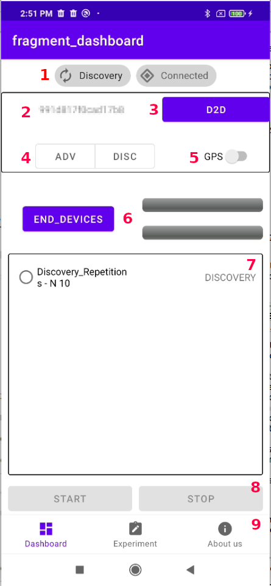

#  AtomD


##Note: 
the tracking of the "CHUNK" and "FILE" experiments are not yet implemented. 
## Overview

AtomD is an application designed to perform D2D measurements in real conditions by using the  [Google Nearby Connections](https://developers.google.com/nearby/connections/overview) API.


This tool allows you to do the following:
- Create and manipulate different experimental environments.
- Track the GSP location (latitude and longitude) for each generated action.
- Obtain the average throughput of the link through file transmission.
- Analyze the delay during the neighbor discovery(ND) process.

## Application support

This application is designed for Sdk 28 to Sdk 33 .
Additionally, it uses the following dependencies:

- location 
- nearby 
- room

## Quickstart


To start using AtomD, you must first make a P2P connection with another device. This can be done by selecting the role for neighbor discovery(4) and pressing the D2D button (3).

When the status panel lights up (1), D2D is running.

To create an experiment, go to the Experiments tab (9), where you can create test experiments using Chunk (new message), throughput test (new file), and connection establishment delay test (new attempts of discovery). 

Each new experiment will be added to a list database (7).

When starting an experiment, choose it from the list of experiments and click start (8). To end the D2D connection, click on stop (8).


## Database

Since AtomD's goal is to analyze the behavior of D2D in real environments, it uses an SQLite database named "atomd_db" to record each experiment log.

The tables corresponding to the database are listed below.

- **chunk_experiments**
    - experiment_name
    - message_size
    - message_attempts
    - message_payload

- **file_experiments**
    - experiment_name
    - file_size
    - number_of_tries

- **connection_attempts**
	-  experiment_name
	-  number_of_repetitions

- **data_connection_attempts**
    - experiment_id: Unique ID of the experiment instance
    - source_id: Readable Id of the device(2)
    - target_id: Readable Id of target device
    - total_attempts: Total number of attempts to be performed
    - low_power: If true, ND is performed by BLE, otherwise with bluetooth classic
    - attempt: Number of attempt performed
    - state: State of the ND where the data was recorded
    - state_timing: Timed time when the data was recorded in milliseconds
    - latitude: Last latitude obtained
    - longitude: Last longitude obtained

## AtomD D2D library functions

#### constructor to initialize the library.
```kotlin
class Builder(private val owner: LifecycleOwner, val deviceName: String, val context: Context){
        fun setListener(listener: D2DListener)
        fun build()
    }
```

#### D2D discovery startup.
```kotlin
fun startDiscovery(strategy: Strategy, lowPower: Boolean)
```

#### D2D advertising startup.
```kotlin
fun startAdvertising(deviceName: String, strategy: Strategy, lowPower: Boolean, connectionType: Int)
```

#### Send a notification message to a connected device.
```kotlin
fun notifyToConnectedDevice(endPointId: String, notificationParameters: JSONObject, afterCompleteTask:()->Unit? )
```

#### Check if a D2D connection exists.
```kotlin
fun isConnected()
```

#### Checks if the device is currently discovering other devices.
```kotlin
fun isDiscovering()
```

#### Stops discovery or advertising events if they are active.
```kotlin
fun stopDiscoveringOrAdvertising()
```

#### Disconnecting from a specific device.
```kotlin
fun disconnectFromDevice(endPointId: String)
```

#### Stops all D2D events.
```kotlin
fun stopAll()
```
```kotlin
fun sendSetOfChunks() -> TODO
```
```kotlin
fun sendSetOfBinaryFile() -> TODO
```

#### Run the experiment to analyze the connection delay in ND.
```kotlin
fun performDiscoverAttempts(targetDevice: String, repetitions: Int, isLowPower: Boolean)
```

#### Requests the necessary permissions to use the library.
```kotlin
fun getRequiredPermissions()
```

#### Enables location
```kotlin
fun enableLocationUpdate(activity : Activity)
```

#### Disables location
```kotlin
fun disableLocationUpdate()
```